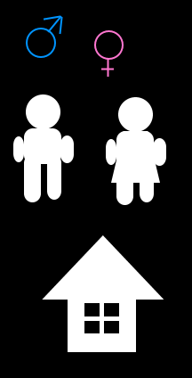
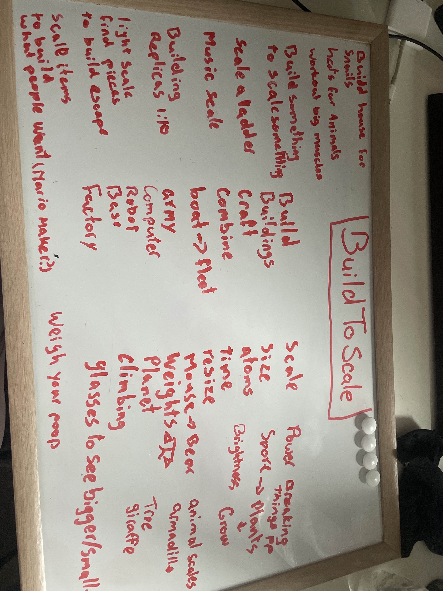
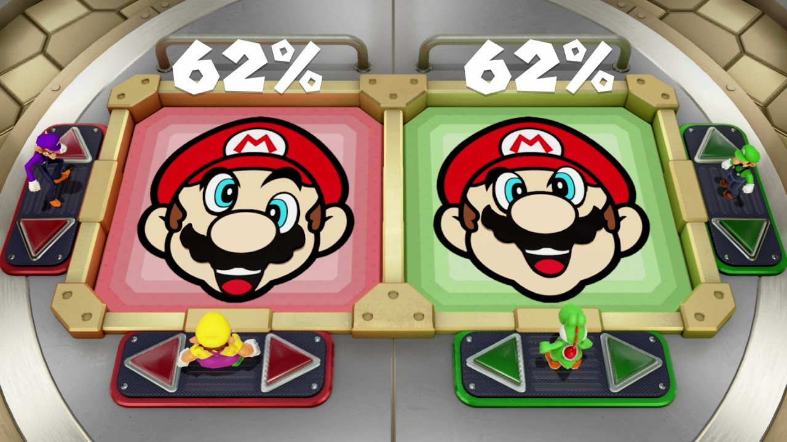

The theme: **Built to Scale**
> Want to see games that make size, scale and dimensions a <u>**key** part of the gameplay</u>

**THINK OUTSIDE THE BOX**

#### Brainstorm
- [Simpsons](https://www.youtube.com/watch?v=qYJw1MaZ6gQ)
- ~~[Everything](https://www.youtube.com/watch?v=hadCMVgJgfU) Also got featured in the GMTK announcement.~~
- build something, like building that must grow
- ~~[Bubble Tanks](https://www.google.com/search?q=bubbletanks&client=firefox-b-d&sca_esv=5f833fc7e19dbbb8&sca_upv=1&udm=2&biw=2144&bih=1077&sxsrf=ADLYWIKkjN1J2RJrQbWmtCG_ZlZAiX5eYA%3A1723828564218&ei=VIm_ZrbvDP2B9u8P2OOWgAs&ved=0ahUKEwi26eTpgfqHAxX9gP0HHdixBbAQ4dUDCBA&uact=5&oq=bubbletanks&gs_lp=Egxnd3Mtd2l6LXNlcnAiC2J1YmJsZXRhbmtzMgkQABiABBgYGAoyCRAAGIAEGBgYCkibFFDZBljnEnABeACQAQCYAUqgAeEFqgECMTG4AQPIAQD4AQGYAgugAooGwgIEECMYJ8ICChAAGIAEGEMYigXCAgUQABiABJgDAIgGAZIHAjExoAeBMw&sclient=gws-wiz-serp)~~
	- ~~Game about shooting enemy bubbles, you steal their bubbles to grow and get upgrades.~~
	- ~~Get shot and you will lose bubbles/abilities & scale~~
- ~~Agar.io~~
- ~~Ant game -> massive structures~~
- ⭐Zooming in/out game
	- Hidden folks
	- Collect resources to build stuff
		- star dust
		- caterpillar
	- evt. platformer/quest game
- ⭐ Memory/rubics cube game for object sizes
	- God game of small elephants that can grow
	- Rubix cube
	- Terraform world so scale is in balance
	- Chicken/ egg large egg, small chicken
	- use of shrink ray
	- Select 2 entities to swap size
		- Memory
	- You will get a scene in front of you
		- Tree
		- Rock
		- Animal
		- House
	- The game generates all items to have determined sizes when the game starts; it will procedurally swap the sizes of the objects, your job is to click on two entities to swap them from size. 
- ~~Platformer of guy that can switch size, small/big~~
	- ~~Pol~~
	- ~~Based on what you want to do switch mid air~~
		- ~~Stomp enemy if you are large, but you need to be small to jump~~
		- ~~Jump higher if you switch from large to small to get extra momentum~~
- Game, change resolution of game is the game to pass through stuff
- Shrink ray game -> portal
- Ant uses upgrades to get bigger
- Guy keeps running; you scale the character to not hit stuff.
	- puzzle platformer where you can scale the platforms up
- Scale man / Pixel man / Boogie man:
	- Jump on / defeat enemies to steal their `pixels` or `bugs` to increase your own size.
	- You will start off as a pixel guy, almost like thomas was alone:
		- 
	- You will defeat enemies to increase in pixel density
		- 
	- Eventually you will become an HD sprite
		- 
	- Or even a 3d character
		- 
	- Getting hit will result in you losing resources, so you will scale down again to a previous level
	- Abilities are provided based how much resources you've gathered.
		- For example; If your pixel man has legs, you can jump. If you are damaged enough ; you will lose the ability to jump untill you collect enough pixels to scale up again
		- 
	- Other styles:
		- You play as boogie man collecting flies/bugs 
- Build a building on an actual scale, but don't tip the scale
	- 
	- You play 2 characters make sure to distribute weight
- Resource management game where you manage some resources on different scales.
	- ...
	- Colony builder on ant scale.
		- 
	- Town builder on human scale.
		-  ![[concept.png]]
	- Solar system builder on planet scale
		- 
	- ...
	- They all influence each other
		- Ants/bugs must survive to allow for fertile ground in the Town builder
		- Solar system must be efficient to allow day/night cycle on the town builder and prevent natural disasters.
		- The Ant & Solar scale allows you to build the Town.
- ⭐Device maker
	- Build devices that require smaller devices
	- 
	- build components by drawing lines
- 
	- Pirate game -> increase fleet
	- ⭐Giantraffe: Giraffe having to eat to get longer neck to eventually go to the moon.
		- [Giantraffe](Giantraffe)
		- Eat leaves to get bigger neck
		- airplane rates your score
		- 
	- Scales: Reptiles
		- As currency?
		- Build with Scales
	- Scale, gains, body builder.
		- Get enough nutrients to build your body.
	- Mario party minigame
		- 
		- You get limited shapes, use those, tilt/scale to create image
	- Music scale -> tones
	- Scale(climb) a ladder:
		- events happen the higher you go.
	- House builder for insects
		- It grows big
	- Build a product for animals that have different sizes
		- Hats/ houses
	- time and space\
	- Object/character that can scale but with downsides like more gravity/less gravity.
		- You attract objects because you are so large
	- Build stuff with atoms
- [Roblox game](https://www.youtube.com/watch?v=zaGaVHyW3ig "https://www.youtube.com/watch?v=zaGaVHyW3ig")
