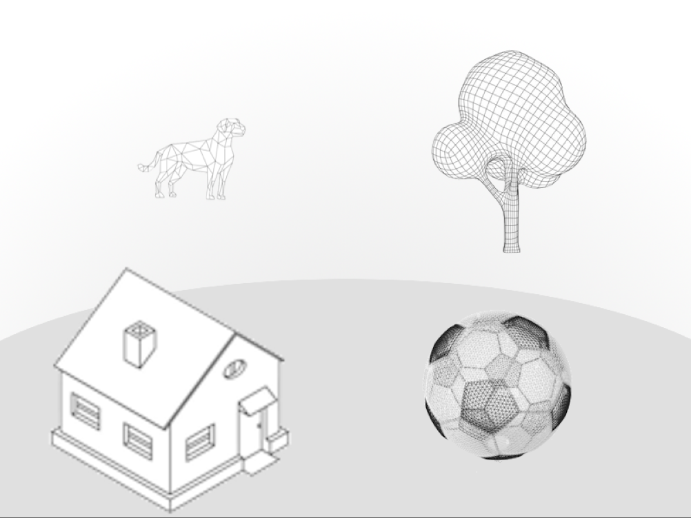

## Pitch
You are presented with a scene of objects. All objects have incorrect sizes, your job is to swap the sizes of objects to all sizes will be relatively correct to one another.
## Inspiration
- [Hidden Folks](https://hiddenfolks.com/)
- Rubik's Cube
- Memory game
## Audience
Everyone.
## Concept
### Gameplay Overview
The presented scene are separate puzzles with more and more objects in later scenes.
Click two object to swap their size properties. The goal of the game is to make all object have correct sizes relatively from one another. (a football should be smaller than a house, but not larger than a dog.)

### GMTK theme
The theme: **Built to Scale**
It's a Rubik's cube memory game based on the relative scaling of all object in the scene 
### Game Mechanics
#### Primary
##### Limited swaps?
You may have limited swaps in order to complete the scene.
##### Winning
You win the game if you correctly swapped all sizes of all objects correctly.
##### Scene generation
When starting, the sizes of all objects are procedurally swapped to make it possible to finish the level. 

#### Secondary
##### Zooming in/out?
You may be able to zoom in and out to select objects of a bigger/smaller scale.
- You have a big ant in the scene and a small tree. Those need to be swapped

## Art
Wireframe objects?
3D models to allow for depth and better judgement of sizes? 
Another option is using an orthographic perspective on 2d objects:

## Audio
none?
## User Experience
### Controls
Controlled with the mouse and with on-screen buttons (swap button)